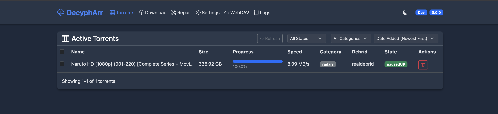

# DecyphArr



**DecyphArr** is an implementation of QbitTorrent with **Multiple Debrid service support**, written in Go.

## What is DecyphArr?

DecyphArr combines the power of QBittorrent with popular Debrid services to enhance your media management. It provides a familiar interface for Sonarr, Radarr, and other \*Arr applications while leveraging the capabilities of Debrid providers.

## Features

- 🔄 Mock Qbittorent API that supports the Arrs (Sonarr, Radarr, Lidarr etc)
- 🖥️ Full-fledged UI for managing torrents
- 🛡️ Proxy support for filtering out un-cached Debrid torrents
- 🔌 Multiple Debrid providers support
- 📁 WebDAV server support for each debrid provider
- 🔧 Repair Worker for missing files

## Supported Debrid Providers

- [Real Debrid](https://real-debrid.com)
- [Torbox](https://torbox.app)
- [Debrid Link](https://debrid-link.com)
- [All Debrid](https://alldebrid.com)

## Quick Start

### Docker (Recommended)

```yaml
version: '3.7'
services:
  decypharr:
    image: cy01/blackhole:latest # or cy01/blackhole:beta
    container_name: decypharr
    ports:
      - "8282:8282" # qBittorrent
    user: "1000:1000"
    volumes:
      - /mnt/:/mnt
      - ./configs/:/app # config.json must be in this directory
    environment:
      - PUID=1000
      - PGID=1000
      - UMASK=002
    restart: unless-stopped
```

## Documentation

For complete documentation, please visit our [Documentation](https://sirrobot01.github.io/debrid-blackhole/).

The documentation includes:

- Detailed installation instructions
- Configuration guide
- Usage with Sonarr/Radarr
- WebDAV setup
- Repair Worker information
- ...and more!

## Basic Configuration

```json
{
  "debrids": [
    {
      "name": "realdebrid",
      "api_key": "your_api_key_here",
      "folder": "/mnt/remote/realdebrid/__all__/",
      "use_webdav": true
    }
  ],
  "qbittorrent": {
    "port": "8282",
    "download_folder": "/mnt/symlinks/",
    "categories": ["sonarr", "radarr"]
  },
  "use_auth": false,
  "log_level": "info"
}
```

## Contributing

Contributions are welcome! Please feel free to submit a Pull Request.

## License
This project is licensed under the MIT License. See the [LICENSE](LICENSE) file for details.