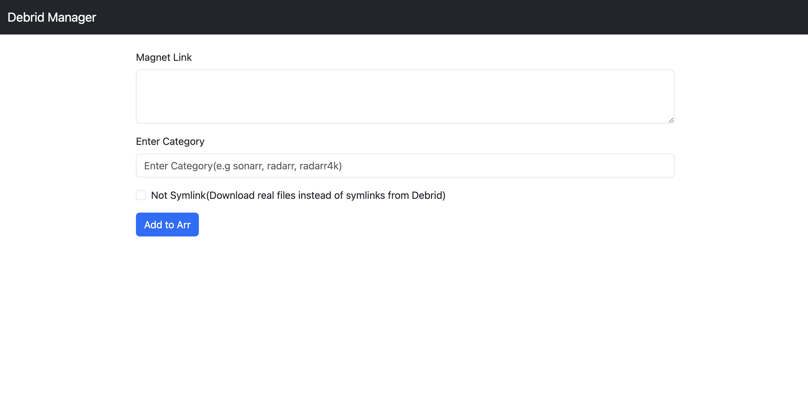

### GoBlackHole(with Debrid Proxy Support)

This is a Golang implementation go Torrent QbitTorrent with a **Real Debrid & Torbox Support**.


### Features

- Mock Qbittorent API that supports the Arrs(Sonarr, Radarr, etc)
- Proxy support for the Arrs
- Real Debrid Support
- Torbox Support
- Debrid Link Support
- Multi-Debrid Providers support
- UI for adding torrents directly to *arrs

The proxy is useful in filtering out un-cached Real Debrid torrents

### Supported Debrid Providers
- Real Debrid
- Torbox
- Debrid Link

### Changelog

- View the [CHANGELOG.md](CHANGELOG.md) for the latest changes


#### Installation
##### Docker Compose
```yaml
version: '3.7'
services:
  blackhole:
    image: cy01/blackhole:latest # or cy01/blackhole:beta
    container_name: blackhole
    ports:
      - "8282:8282" # qBittorrent
      - "8181:8181" # Proxy
    user: "1000:1000"
    volumes:
      - ./logs:/app/logs
      - ~/plex/media:/media
      - ~/plex/media/symlinks/:/media/symlinks/
      - ~/plex/configs/blackhole/config.json:/app/config.json # Config file, see below
    environment:
      - PUID=1000
      - PGID=1000
      - UMASK=002
      - QBIT_PORT=8282 # qBittorrent Port. This is optional. You can set this in the config file
      - PORT=8181 # Proxy Port. This is optional. You can set this in the config file
    restart: unless-stopped
    depends_on:
      - rclone # If you are using rclone with docker
    
```

##### Binary
Download the binary from the releases page and run it with the config file.

```bash
./blackhole --config /path/to/config.json
```

#### Config
```json
{
  "debrids": [
    {
      "name": "torbox",
      "host": "https://api.torbox.app/v1",
      "api_key": "torbox_api_key",
      "folder": "data/torbox/torrents/",
      "rate_limit": "250/minute",
      "download_uncached": false,
      "check_cached": true
    },
    {
      "name": "realdebrid",
      "host": "https://api.real-debrid.com/rest/1.0",
      "api_key": "realdebrid_key",
      "folder": "data/realdebrid/torrents/",
      "rate_limit": "250/minute",
      "download_uncached": false,
      "check_cached": false
    },
    {
      "name": "debridlink",
      "host": "https://debrid-link.com/api/v2",
      "api_key": "debridlink_key",
      "folder": "data/debridlink/torrents/",
      "rate_limit": "250/minute",
      "download_uncached": false,
      "check_cached": false
    }
  ],
  "proxy": {
    "enabled": true,
    "port": "8100",
    "debug": false,
    "username": "username",
    "password": "password",
    "cached_only": true
  },
  "max_cache_size": 1000,
  "qbittorrent": {
    "port": "8282",
    "download_folder": "/media/symlinks/",
    "categories": ["sonarr", "radarr"],
    "refresh_interval": 5
  }
}
```

#### Config Notes
##### Max Cache Size
- The `max_cache_size` key is used to set the maximum number of infohashes that can be stored in the availability cache. This is used to prevent round trip to the debrid provider when using the proxy/Qbittorrent
- The default value is `1000`
- The cache is stored in memory and is not persisted on restart

##### Debrid Config
- The `debrids` key is an array of debrid providers
- The `name` key is the name of the debrid provider
- The `host` key is the API endpoint of the debrid provider
- The `api_key` key is the API key of the debrid provider
- The `folder` key is the folder where the torrents will be downloaded. e.g `data/realdebrid/torrents/`
- The `rate_limit` key is the rate limit of the debrid provider(null by default)
- The `download_uncached` bool key is used to download uncached torrents(disabled by default)
- The `check_cached` bool key is used to check if the torrent is cached(disabled by default)

##### Proxy Config
- The `enabled` key is used to enable the proxy
- The `port` key is the port the proxy will listen on
- The `debug` key is used to enable debug logs
- The `username` and `password` keys are used for basic authentication
- The `cached_only` means only cached torrents will be returned


##### Qbittorrent Config
- The `port` key is the port the qBittorrent will listen on
- The `download_folder` is the folder where the torrents will be downloaded. e.g `/media/symlinks/`
- The `categories` key is used to filter out torrents based on the category. e.g `sonarr`, `radarr`
- The `refresh_interval` key is used to set the interval in minutes to refresh the Arrs Monitored Downloads(it's in seconds). The default value is `5` seconds

### Proxy

The proxy is useful in filtering out un-cached Real Debrid torrents. 
The proxy is a simple HTTP proxy that requires basic authentication. The proxy can be enabled by setting the `proxy.enabled` to `true` in the config file. 
The proxy listens on the port `8181` by default. The username and password can be set in the config file.

Setting Up Proxy in Arr

- Sonarr/Radarr
  - Settings -> General -> Use Proxy
  - Hostname: `localhost` # or the IP of the server
  - Port: `8181` # or the port set in the config file
  - Username: `username` # or the username set in the config file
  - Password: `password` # or the password set in the config file
  - Bypass Proxy for Local Addresses -> `No`

### Qbittorrent

The qBittorrent is a mock qBittorrent API that supports the Arrs(Sonarr, Radarr, etc).

Setting Up Qbittorrent in Arr

- Sonarr/Radarr
  - Settings -> Download Client -> Add Client -> qBittorrent
  - Host: `localhost` # or the IP of the server
  - Port: `8282` # or the port set in the config file/ docker-compose env
  - Username: `http://sonarr:8989` # Your arr host with http/https
  - Password: `sonarr_token` # Your arr token
  - Category: e.g `sonarr`, `radarr`
  - Use SSL -> `No`
  - Sequential Download -> `No`|`Yes` (If you want to download the torrents locally instead of symlink)
  - Test
  - Save

### UI for adding torrents



The UI is a simple web interface that allows you to add torrents directly to the Arrs(Sonarr, Radarr, etc)

### TODO
- [ ] A proper name!!!!
- [ ] Debrid
  - [ ] Add more Debrid Providers

- [ ] Qbittorrent
  - [ ] Add more Qbittorrent features
  - [ ] Persist torrents on restart/server crash
- [ ] Add tests